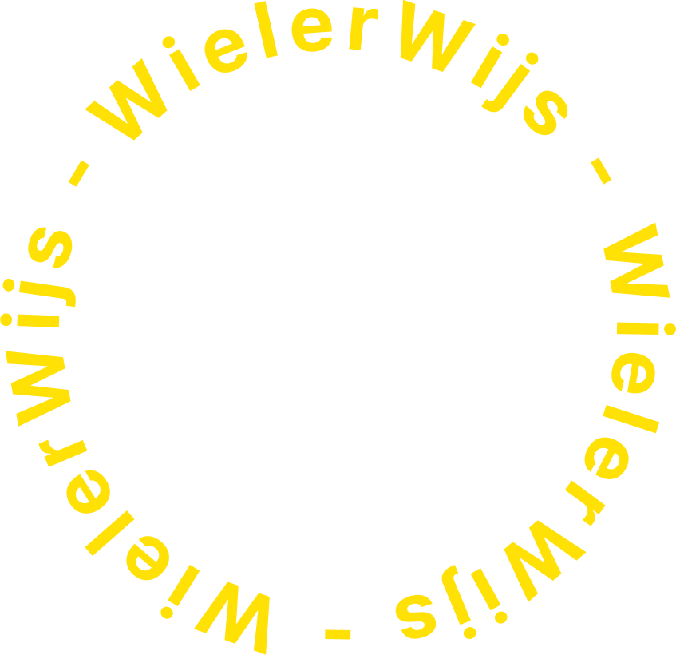

WielerWijs is een website waarop gebruikers zelf teams van bestaande professionele wielrenners kunnen samenstellen en deze beoordeeld worden door anderen. Gebruikers kunnen ook van wielrenners aangeven tot welke categorie ze vinden dat een renner behoort (klimmer, sprinter, klassieke renner, knecht). Op deze manier brengen we wielerfans in verbinding en kunnen ze in de rol van een teammanager kruipen!

## Startup

Om op te starten is een Apache Tomcat (ik gebruik versie 9.0.76) configuratie nodig voor de Java backend. De frontend is te runnen door de volgende commands uit te voeren:
```bash
cd src/frontend
npm run dev
```
> [!WARNING]
> Let op, IDs zijn gesimplificieerd naar getallen. In werkelijkheid zal elk nieuw aangemaakt object een uniek ID krijgen waardoor deze niet direct in te vullen zijn in de Postman collectie. Verander deze waardes voor de juiste resultaten.

Gebruik de [bijgevoegde Postman collection](./IPASS.postman_collection.json) om renner data in te laden wanneer je de app voor het eerst opstart. 
